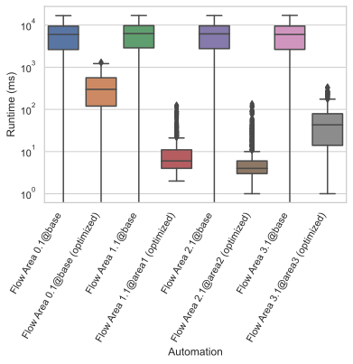
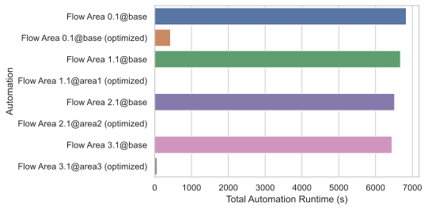

# Decentralized Automation Networks - Evaluation

This is a simple Python-based Jupyter notebook that is used for analyzing the database dumpy created by the [proxy server](https://github.com/Chaphasilor/decentralized-automation-networks_proxy).  
To use it, add the paths to all JSON dumps that you would like to analyze to the first code block, in `filesToCompare`.  
For each JSON file, a separate plot will be created for every metric.  
Plots are saved to the `plots/` folder as individual PDFs by default. This can easily by changed to SVG or other formats if desired.

If you want to compare results between multiple dumps, simply copy the relevant sections from each JSON file into a new file. For example, [this file](0.1-3.3_2-minutes_low-load/compare.json) contains data from four different automations, where each automations has been recorded while using a centralized topology as well as the decentralized one. The individual entries were taken from multiple JSON dumps coming from different proxy servers. The JSON entries were then renamed to better reflect what kind of results they represented.  
In the end, a single plot showing all the automations is created, where automations are sorted alphabetically.

The resulting plots will look somethings like this:

